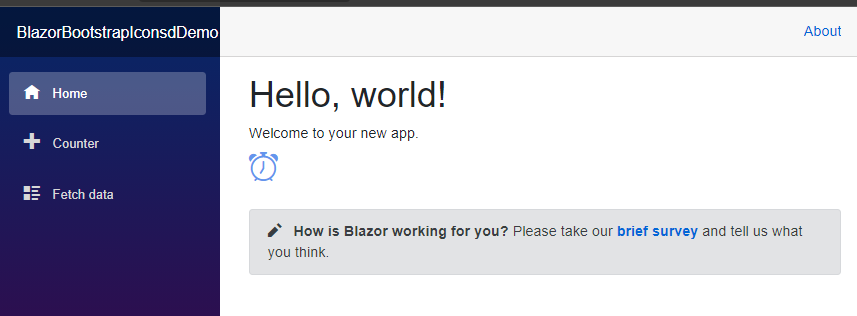
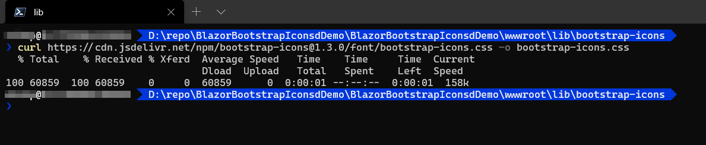
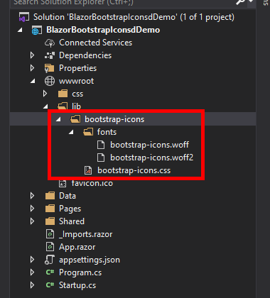
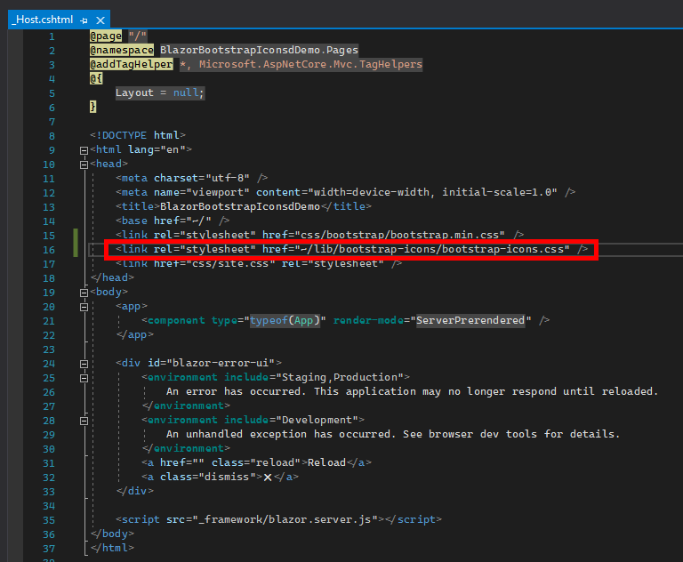
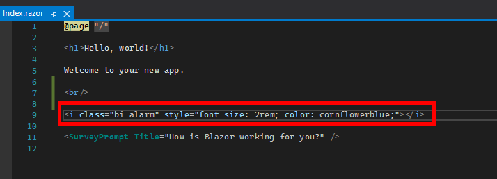

# Using Bootstrap Icons in ASP.NET Core Blazor project

This repository demonstrate how to use [Bootstrap Icons](https://icons.getbootstrap.com/) in ASP.NET Core Project:

1. Download the [Bootstrap Icons zip file distribution](https://github.com/twbs/icons/releases)
2. Using curl or browser to download the **bootstrap-icons.css** in to the `wwwroot\lib\bootstrap-icons` folder in project:  
   
3. Extract the **fonts** folder from the zip file distribution into the `wwwroot\lib\bootstrap-icons\fonts` folder in project, like following structure:  
   
4. Add CSS reference in `Pages\_Host.cshtml` file:  
   
5. Use *Icon font* notation in razor files:  
   
